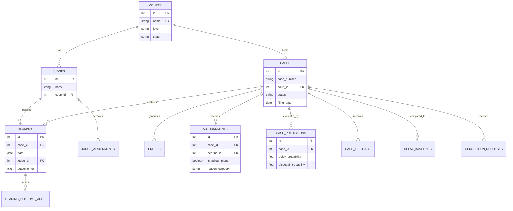

# Court Case Delay & Justice Tracker - India ⚖️🇮🇳

> *"Justice delayed is justice denied. This project is a voluntary, community-driven effort to bring transparency and accountability to the Indian judicial system."*

A public accountability platform built as a **voluntary initiative** for the citizens of India. I developed this project to showcase my engineering skills to recruiters while contributing to a cause I deeply care about. This platform tracks court timelines, adjournments, delay patterns, disposal rates, and potential public-official involvement in Indian court cases. My goal was to leverage my technical abilities—spanning from data engineering and machine learning to full-stack development—to build something impactful for my country.

---

## 🌟 Why I Built This (Community & Voluntary Work)

As a citizen deeply invested in the progress of India, I realized that one of the biggest hurdles to equitable justice is the opacity of court delays. This platform was born out of a desire to volunteer my software engineering skills for a cause greater than myself. By scraping, normalizing, and analyzing public judicial data, this project aims to provide researchers, journalists, and citizens with the insights they need to advocate for a more accountable judicial system. It's my small way of giving back to the community and working towards a better India.

**For Recruiters:** This repository demonstrates my capability to architect and deliver complex, end-to-end data-intensive applications. You'll find evidence of clean system design, production-grade ingestion pipelines, machine learning integration, and robust backend engineering. We have used `graphify` to map out the system architecture and provide visual insights into the codebase and relationships.

---

## System Architecture & Insights (Generated via Graphify)

To help recruiters and contributors quickly understand the architecture of this platform, I have mapped the codebase using [Graphify](https://github.com/safishamsi/graphify). This provides a complete knowledge graph of the system. 

### 🗺️ Core Architecture Diagram
Here is the central case management domain diagram showing the relationships between courts, judges, cases, and delay analytics features.



*For an interactive 3D knowledge graph of the entire system structure generated by Graphify, please open `graphify-out/graph.html` in your browser.*

### 🌌 Complete System Knowledge Graph
Here is the full system architecture generated by Graphify, highlighting all module communities and dependencies:


### ⚡ Architectural Insights (God Nodes)
These are the most highly-connected core abstractions in the codebase, showcasing robust modular design:
1. `IngestionSource` - Core model for our resilient data pipelines (76 edges)
2. `Base` - SQLAlchemy declarative base (64 edges)
3. `RTIGenerator` - Automated Right-to-Information request generator (51 edges)
4. `FeatureEngineer` - Machine Learning feature extraction for delays (49 edges)
5. `StorageClient` - Cloud-agnostic object storage wrapper (48 edges)

### 🔗 Surprising/Implicit Connections
Graphify surfaced several cross-module dependencies that highlight the system's integration:
- `_serialize_case()` (API routes) calls `build_delay_summary_text()` (Analytics) 
- `KaplanMeierResult` (Hazard models) bridges directly with the `km.py` estimators for survival curves.
- `UploadFile` (FastAPI) triggers `FeedbackService` for automated moderation and public feedback gathering.

---

## One-Click Start

### Prerequisites

- Docker Desktop (or Docker Engine + Compose plugin)
- GNU Make

### Start Everything

```bash
make up
```

`make up` handles:

- env file creation (`.env` from `.env.example`)
- image builds and dependency install
- PostgreSQL + Redis startup with health checks
- backend bootstrap sequence:
  - wait for DB and Redis
  - run Alembic migrations
  - initialize `ingestion_sources`
  - load sample data when database is empty
  - start FastAPI
- Celery worker + beat startup after backend is healthy
- frontend startup after backend is healthy

### URLs

- Frontend: `http://localhost:3000`
- Backend API: `http://localhost:8000`
- API Docs: `http://localhost:8000/docs`
- Health: `http://localhost:8000/health`
- Local Postgres: `localhost:55433` (`postgres/postgres`)

## Legal Disclaimer

Data aggregated from public judicial sources. Verify with official records.

## Project Structure

```text
judiciary_accountibility/
  backend/
    alembic/
      versions/0001_initial.py
    app/
      api/routes/
      core/
      db/
      models/
      schemas/
      scrapers/sources/
      services/
      tasks/
      utils/
      main.py
      celery_app.py
    scripts/seed.py
    tests/
    requirements.txt
    Dockerfile
  frontend/
    app/
      cases/[id]/page.tsx
      judges/[id]/page.tsx
      heatmap/page.tsx
      search/page.tsx
      layout.tsx
      page.tsx
      globals.css
    components/
    package.json
    Dockerfile
  docker-compose.yml
  .env.example
  Makefile
```

## Backend Overview

- Python 3.11 + FastAPI + SQLAlchemy 2.0
- PostgreSQL + Alembic migrations
- Celery + Redis for daily ingestion jobs
- Scrapers implemented for:
  - NJDG
  - eCourts Services
  - High Court cause lists (HTML + PDF parser integration)
  - Supreme Court cause lists
- Raw response storage under `backend/raw_data/` for auditability
- Idempotent normalization/upsert pipeline
- Delay metrics and anomaly flags
- Public-official CSV import + fuzzy matching (RapidFuzz)

### Required Tables

Implemented via SQLAlchemy models and migration:

- `courts`
- `judges`
- `cases`
- `hearings`
- `adjournments`
- `orders`
- `flags`
- `public_officials`
- `case_party_links`
- `ingestion_logs`

Includes indexes and soft-delete columns (`is_deleted`, `deleted_at`).

## API Endpoints

Base prefix: `/api/v1`

- `GET /courts`
- `GET /cases`
- `GET /cases/{id}`
- `GET /cases/{id}/timeline`
- `GET /judges`
- `GET /judges/{id}`
- `GET /judges/{id}/stats`
- `GET /stats/court`
- `GET /stats/judge`
- `GET /flags`
- `GET /disclaimer`
- `GET /health`

`GET /cases` supports filtering with:

- `court`
- `state`
- `case_type`
- `party_name`
- `start_date`, `end_date`
- `flagged_only`
- `politician_only`
- `page`, `page_size`

## Delay Metrics Engine

Implemented metrics:

- Time to disposal
- Time between hearings
- Adjournment rate per case
- Adjournment rate per judge
- Court backlog indicators

Anomaly flags created where:

- Time between hearings > 2x court median
- Adjournment rate > mean + 2 standard deviations

## Local Development

### Common Commands

```bash
make up       # one-click start (recommended)
make down     # stop services
make logs     # follow service logs
make migrate  # run migrations manually
make seed     # seed sample data manually
make clean    # stop and remove volumes
make test     # run backend tests
```

### Manual Troubleshooting

- If startup fails, inspect logs:

```bash
make logs
```

- If port binding errors occur, free these ports or change mappings:
  - `3000` (frontend)
  - `6379` (redis)
  - `8000` (backend)
  - `55433` (postgres host port)

- If you need a clean local reset:

```bash
make clean
make up
```

### Run tests

```bash
make test
```

Frontend: http://localhost:3000  
Backend API docs: http://localhost:8000/docs

## Daily Scheduler

Celery Beat triggers daily ingestion task:

- Task: `app.tasks.ingestion.run_daily_ingestion`
- Schedule: daily at 02:00 UTC

## Production Scale Additions

- Redis API response caching with namespace invalidation after ingestion.
- Compound index migration for heavy filters and timeline workloads.
- Concurrent URL fetching in scrapers with bounded concurrency.
- Global API rate limiting via SlowAPI.
- Prometheus monitoring hooks:
  - request count and latency
  - cache hit and miss counters
  - scraper fetch success and failure counters
  - ingestion success and failure counters

Metrics endpoint: /metrics

## Ingestion Operations

- Operational runbook: `backend/app/docs/ingestion_runbook.md`
- Cost estimator script: `backend/app/scripts/cost_estimator.py`
- Reprocess task: `app.tasks.reprocess.reprocess_raw_snapshots`

## ML Module — Case Duration Prediction & Delay Detection

An **optional, production-ready** machine learning layer that predicts how long
a case should take and flags unusually delayed cases.  The rest of the system
operates normally when the ML module is disabled or the model is not trained.

### Activation

```bash
# .env
ML_ENABLED=true           # default; set false to disable entirely
ML_MIN_CASES=500          # minimum disposed cases required for a real model
ML_DELAY_THRESHOLD_MODERATE=1.5
ML_DELAY_THRESHOLD_SEVERE=2.0
ML_DELAY_THRESHOLD_EXTREME=3.0
ML_ARTIFACTS_DIR=app/ml/artifacts
```

### Architecture

```
backend/app/ml/
  __init__.py        — module docstring / public overview
  config.py          — MLSettings (pydantic-settings, ML_ prefix)
  features.py        — CaseFeatures dataclass + FeatureExtractor
  dataset.py         — DB → DataFrame assembly (training & inference)
  evaluation.py      — MAE, RMSE, Median AE, R², time-based split
  train.py           — ModelTrainer, BaselineMedianModel
  predict.py         — CaseDurationPredictor singleton, PredictionResult
  outliers.py        — delay ratio, severity classification, batch flagging
  artifacts/         — model binaries (gitignored; generated at runtime)

## Hearing Outcome Classification

The ingestion subsystem distinguishes listing entries from substantive proceedings using a deterministic parser, corroboration rules, and optional ML fallback.

### Canonical Outcome Types

- LISTED
- HEARD
- ADJOURNED
- ORDER_RESERVED
- DISPOSED
- NOT_REACHED
- NO_PROCEEDINGS
- OTHER

Persisted hearing fields:

- outcome_type
- outcome_confidence (0.0 to 1.0)
- raw_outcome_text
- parser_version
- annotated_by
- annotated_at

### Rule Engine and Confidence

The parser runs ordered high-precision keyword rules first, then falls back:

1. ADJOURNED: adjourn, postponed, deferred, put up, relisted, adjd, adjd., adj., adjourned to
2. HEARD: heard, argument heard, taken up, considered, heard today
3. ORDER_RESERVED: order reserved, order kept, reserved, orders reserved
4. DISPOSED: disposed, dismissed, pronounced, judgment, ug, allowed, dismissed with costs
5. NOT_REACHED / NO_PROCEEDINGS: not reached, not taken up, no proceedings, not heard, case not taken
6. LISTED when only scheduling/listing hints are present

Corroboration logic then adjusts confidence:

- Same-day order PDF with disposal cues overrides to DISPOSED (0.99)
- Cause-list LISTED plus same-day order upgrades to HEARD or DISPOSED
- Multi-source agreement combines confidence values and boosts certainty
- Ambiguous or unsupported language text is marked OTHER and queued for review

Review threshold:

- DEFAULT_OUTCOME_CONFIDENCE_VERIFY (default 0.60)

### Optional ML Fallback

Set ML_PARSER_ENABLED=true to enable ML disambiguation for low-confidence/OTHER outcomes.

- Model: lightweight sklearn text+metadata classifier
- Training data: admin-annotated hearings
- Artifacts: backend/app/ml/artifacts/hearing_outcome_model.pkl and hearing_outcome_evaluation.json
- Retraining task: app.tasks.hearing_outcomes.retrain_hearing_outcome_model

### Admin Verification Workflow

- GET /api/v1/admin/hearings/review?threshold=0.6
- POST /api/v1/admin/hearings/{id}/annotate
- POST /api/v1/admin/hearings/{id}/reprocess
- GET /api/v1/admin/hearings/{id}/audit

Annotation and reprocessing actions are audit logged with previous/new values, actor, timestamp, and parser version transitions.

### Reprocessing and Backfill

- Scheduled refresh task: app.tasks.hearing_outcomes.reprocess_hearing_outcomes
- Backfill script: backend/app/scripts/backfill_hearing_outcomes.py
- Alembic hardening migration: backend/alembic/versions/0019_hearing_outcome_hardening.py

### Frontend Display Guidance

Timeline and admin views should show:

- Outcome badge (LISTED, HEARD, ADJOURNED, etc.)
- Confidence bar with numeric score
- Why tooltip containing matched keywords, matched rules, and corroborating sources
- Source links to cause-list/order artifacts
- Needs verification CTA when confidence is below threshold or outcome is OTHER
```

### Feature Engineering

| Feature | Description |
|---|---|
| `court_level` | district / high / supreme |
| `state` | case state |
| `case_type` | OHE encoded |
| `filing_year`, `filing_month` | filing calendar context |
| `filing_month_sin/cos` | cyclical encoding of month |
| `number_of_parties` | count of linked parties |
| `politician_flag` | 1 if any party is a public official |
| `corruption_keywords_flag` | 1 if corruption keywords detected |
| `historical_adj_rate` | fraction of hearings at court that were adjourn |
| `backlog_at_filing` | cases filed at court in prior 90 days (proxy) |
| `log_backlog` | log1p(backlog) to reduce skew |
| `judge_id` | high-cardinality optional FK; passed through directly |

### Models Trained

1. **BaselineMedianModel** — median duration by `(court_level, case_type)`.
   Always trained and used as fallback when data is below `ML_MIN_CASES`.
2. **Ridge Regression** — OHE + Standard Scaler preprocessing, `alpha=100`.
3. **HistGradientBoostingRegressor** — quantile GBT trained at q=0.50.
   Native NaN support; no imputation needed for numeric columns.

Two additional quantile models at `ML_QUANTILE_LOWER` (default 10th) and
`ML_QUANTILE_UPPER` (default 90th) provide the prediction interval.

### Delay Severity

| Severity | delay_ratio threshold |
|---|---|
| moderate | ≥ 1.5 |
| severe | ≥ 2.0 |
| extreme | ≥ 3.0 |

`delay_ratio = current_age_days / predicted_duration_days`

### API Endpoints

```
GET /api/v1/ml/case/{id}/prediction   # per-case duration forecast + delay flag
GET /api/v1/ml/status                 # loaded model version and metrics
```

Sample response:

```json
{
  "ml_available": true,
  "predicted_duration_days": 847.3,
  "lower_bound_days": 540.0,
  "upper_bound_days": 1210.0,
  "confidence_score": 0.612,
  "delay_ratio": 1.46,
  "ml_delay_flag": false,
  "ml_delay_severity": null,
  "feature_importance": [
    {"feature": "court_level_district", "importance": 0.312}
  ]
}
```

When the model is not trained, the endpoint returns:

```json
{"ml_available": false, "reason": "Model not trained yet — run the training task first"}
```

### Training & Retraining

```bash
# Manual one-off training via Celery
docker compose exec celery-worker celery call app.tasks.ml_train.retrain_duration_model

# Scheduled automatically via Celery Beat:
#   - Full retrain: every Monday at 03:00 UTC
#   - Batch inference: every day at 04:00 UTC (after ingestion)
```

Artifacts are overwritten on each retrain.  The model version string
(`vYYYYMMDD_HHMM`) is stored in `metadata.json` and returned in every
API response.

### Database

Migration `0003_ml_predictions` adds the `case_predictions` table:

| Column | Type | Description |
|---|---|---|
| `predicted_duration_days` | float | Point estimate |
| `lower_bound_days` | float | q10 quantile prediction |
| `upper_bound_days` | float | q90 quantile prediction |
| `confidence_score` | float | 1 − interval_width / (2 × prediction) |
| `delay_ratio` | float | current_age / predicted |
| `ml_delay_flag` | bool | True if any severity applies |
| `ml_delay_severity` | str | moderate / severe / extreme / null |
| `ml_model_version` | str | version string of the model that produced this |
| `feature_importance` | JSONB | top-10 feature importances |

### Running Tests

```bash
make test
# or directly:
cd backend && pytest tests/test_ml.py -v
```

## Hearing Outcome Classification

The backend now separates a hearing being merely listed from an actual hearing outcome.

### Stored Fields

Migration `0005_hearing_outcomes` adds the `hearing_outcome_type` enum and the following `hearings` columns:

- `outcome_type`
- `outcome_confidence`
- `raw_outcome_text`
- `parser_version`
- `annotated_by`
- `annotated_at`

It also adds `hearing_outcome_audits` for admin override/reprocess audit history.

### Canonical Outcome Types

- `LISTED`
- `HEARD`
- `ADJOURNED`
- `ORDER_RESERVED`
- `DISPOSED`
- `NOT_REACHED`
- `NO_PROCEEDINGS`
- `OTHER`

### Parser Flow

1. Raw hearing text is persisted to `raw_outcome_text`.
2. A deterministic rule engine runs first using compiled keyword patterns.
3. Same-day orders can override a listing-only entry to `HEARD` or `DISPOSED`.
4. Independent corroborating sources boost confidence with a Bayes-like confidence combination.
5. If the rule engine is ambiguous and `ML_PARSER_ENABLED=true`, an optional sklearn classifier may disambiguate.
6. Outcomes below `DEFAULT_OUTCOME_CONFIDENCE_VERIFY` or classified as `OTHER` are surfaced in the review queue.

### Rule Examples

- `adjourned`, `deferred`, `put up`, `relisted` → `ADJOURNED`
- `heard`, `argument heard`, `taken up`, `considered` → `HEARD`
- `order reserved`, `orders reserved` → `ORDER_RESERVED`
- `disposed`, `dismissed`, `judgment pronounced`, `allowed` → `DISPOSED`
- `not reached`, `not taken up` → `NOT_REACHED`
- `no proceedings` → `NO_PROCEEDINGS`
- listing-only cause-list entries with no outcome token → `LISTED`

### Admin Workflow

New endpoints:

- `GET /api/v1/admin/hearings/review`
- `POST /api/v1/admin/hearings/{id}/annotate`
- `POST /api/v1/admin/hearings/{id}/reprocess`
- `GET /api/v1/admin/hearings/{id}/audit`

Admin annotations set confidence to `1.0`, stamp `annotated_by` and `annotated_at`, and create a durable audit record with previous and new values.

### Reprocessing and ML Retraining

Celery tasks:

- `app.tasks.hearing_outcomes.reprocess_hearing_outcomes`
- `app.tasks.hearing_outcomes.retrain_hearing_outcome_model`

Beat schedule:

- daily parser refresh at 05:00 UTC
- weekly outcome-parser ML retrain on Monday at 03:30 UTC

### Evidence Bundle

Case timeline responses now include an evidence bundle per hearing with:

- `raw_outcome_text`
- `parser_confidence`
- `source_links`
- matched keywords and rules
- corroborating order PDFs
- original cause-list link
- a `needs_verification` flag

### Frontend Display Hints

- Show an outcome badge using the canonical enum label.
- Render a confidence bar from `outcome_confidence`.
- Use the evidence bundle `why`, `matched_keywords`, and `source_names` in a tooltip.
- If `needs_verification=true`, show CTA text: `Needs verification`.
- For manual review screens, sort by lowest confidence first and expose the audit trail inline.

### Validation

Targeted coverage for this subsystem lives in:

- `backend/tests/test_hearing_outcomes.py`

Run it with:

```bash
cd backend && pytest tests/test_hearing_outcomes.py -v
```

## Judge Attribution Architecture

The platform now stores judge attribution as first-class, auditable data at the hearing level.

### Storage Model

- `judge_registry`: canonical judge identities, variants, phonetic keys, designations, provenance, provisional flag.
- `judge_assignments`: one row per hearing+judge token with ordered bench sequence, role, confidence, and provenance.
- `judge_attribution_audits`: immutable audit trail for auto-assign, manual overrides, merges, and reconciliation suggestions.
- `hearings.raw_bench`: raw bench/coram string snapshot used for deterministic reprocessing.

### Matching Pipeline

1. Scrapers persist raw bench strings (`raw_bench`) per hearing.
2. Bench parser tokenizes ordered judge names from common formats (`Coram:`, single/division bench, initials, separators).
3. Resolver normalizes names, computes phonetic keys, and scores registry candidates.
4. If no confident match is found, a provisional registry entry is created (`is_provisional=true`) and linked.
5. Assignments are persisted with confidence, match method (`exact`, `fuzzy`, `phonetic`, `tenure`, `manual`, `ML_MATCH`), parser version, source id, and run id.

### Confidence Formula

Score combines weighted components:

$$
S = 0.30E + 0.20T + 0.20L + 0.10P + 0.10C + 0.05U + 0.05D
$$

Where:

- $E$: exact normalized-name match
- $T$: token-overlap similarity
- $L$: Levenshtein similarity
- $P$: phonetic-key match
- $C$: court-context match
- $U$: tenure overlap with hearing date
- $D$: designation match

### Admin Workflows

- `GET /api/v1/admin/judges/review`: low-confidence assignments + provisional registry + merge suggestions.
- `POST /api/v1/admin/judges/{registry_id}/merge`: merge duplicate registry entries while preserving audit trail.
- `POST /api/v1/admin/hearings/{hearing_id}/assign-judge`: manual override or correction with mandatory admin id and audit reason.
- `GET /api/v1/judges/{judge_id}/profile`: registry profile, tenure summary, linked hearings, merge history.

### Reprocessing and Backfill

- Automatic reconcile task: `app.tasks.judge_reconcile.reconcile_judges` (daily).
- Optional roster seeding task: `app.tasks.judge_reconcile.seed_official_judge_registry`.
- Backfill script: `backend/scripts/backfill_judge_attribution.py`.

Dry-run example:

```bash
cd backend && .venv/bin/python scripts/backfill_judge_attribution.py --dry-run --limit 2000
```

### Frontend Integration Hints

- Hearing timeline payload now includes `raw_bench` and `judge_assignments`.
- Render judge badges in `sequence_index` order with `role` labels (Presiding/Member).
- Show assignment confidence bars and tooltip explanation from `tooltip_why`.
- If assignment confidence < `JUDGE_MATCH_CONFIDENCE_THRESHOLD`, render `Needs verification` CTA to admin review.
- Judge profile endpoint supports journalist-friendly hearing exports via paginated linked hearings list.

### Known Limitations and Mitigations

- Transliteration inconsistencies can lower confidence: provisional entries + manual merge workflow mitigate this.
- Identical names across courts can collide: court-id and tenure weighting reduce false merges.
- Non-English bench strings are partially supported: unresolved entries remain auditable and reviewable.

## Security and Data Safety Notes

- No write-back to court systems.
- Ingestion is read-only.
- Raw payload references are retained for audits.
- Soft-delete strategy preserves historical records.
- No hardcoded secrets; env-driven config.

## Resilient Ingestion Architecture

Production-grade ingestion hardening is implemented under
`backend/app/ingestion/` to ensure source failures never go unnoticed and
recovery is operator-friendly.

### What It Adds

- Source registry and health model (`ingestion_sources`)
- Run-level audit log (`ingestion_runs`)
- Ten-step resilient pipeline (fetch, schema checks, parse, upsert, metrics, health FSM)
- Three detectors:
  - schema change (`detectors/schema_change.py`)
  - volume anomaly (`detectors/volume_anomaly.py`)
  - parser confidence (`detectors/parser_confidence.py`)
- Alert manager with email + webhook + log escalation
- Cross-source monitor sweep
- Manual controls: pause/resume/force-run/manual upload/health override
- Recovery tools: backoff, checkpoints, raw payload reprocessing
- Dynamic scheduler with failure-aware backoff

### API Endpoints

Base prefix: `/api/v1/ingestion`

- `GET /sources`
- `GET /sources/{id}/health`
- `GET /runs`
- `POST /sources/{id}/pause`
- `POST /sources/{id}/resume`
- `POST /sources/{id}/run`
- `POST /manual-upload`
- `POST /runs/{run_id}/reprocess`
- `PUT /sources/{id}/health-override`

### Celery Tasks

- `app.tasks.ingestion_tasks.run_single_source`
- `app.tasks.ingestion_tasks.run_ingestion_scheduler`
- `app.tasks.ingestion_tasks.run_monitor_sweep_task`

Beat schedule additions:

- ingestion scheduler sweep: every 5 minutes
- monitor sweep: every 15 minutes

### Database Migration

Run Alembic migration `0004_ingestion_resilience` to create:

- `ingestion_sources`
- `ingestion_runs`

### Environment Variables

All ingestion config is env-driven with `INGEST_` prefix. See `.env.example`
for complete defaults (thresholds, retry/backoff, storage directories,
SMTP/webhook alert settings, scheduler interval).

## Known MVP Limits

- Source parser rules are initial adapters and need source-specific hardening for production anti-bot and schema drift.
- eCourts/NJDG may require captcha-aware or API-backed ingestion in real deployments.
- Frontend heatmap currently uses card-based intensity rendering; geo-map integration can be added with Leaflet in next iteration.
