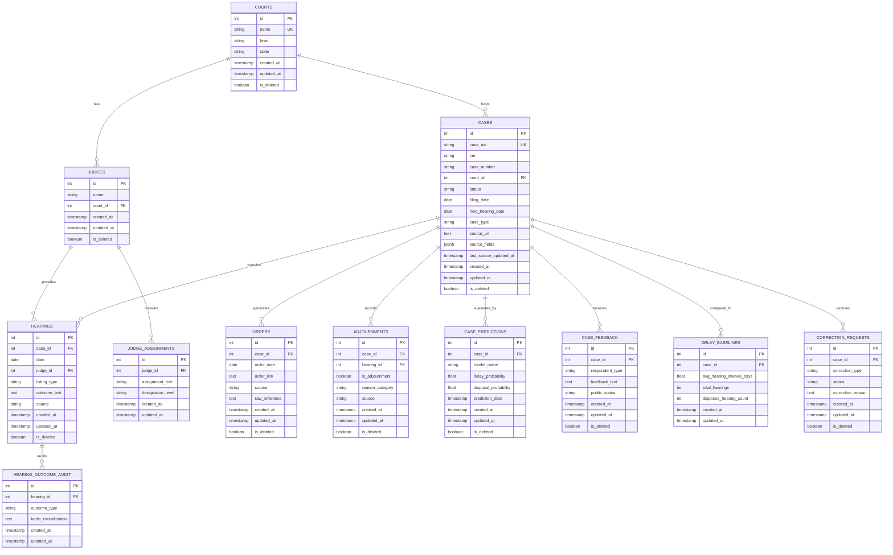

# Architecture: Core Case Management Domain (Mermaid ER Diagram)

This diagram shows the central case management tables and their relationships.

## Mermaid ER Diagram



## Entity Descriptions

### COURTS
Central registry of all courts in the system.
- **Key fields**: id (PK), name (UK), level (e.g., "high_court", "district_court"), state
- **Importance**: Every case must reference a court

### JUDGES
Registry of judicial officers.
- **Relationships**: Assigned to one COURT, preside over HEARINGS
- **Key fields**: id, name, court_id (FK)

### CASES
Central case entity—the heart of the system.
- **Key fields**: id (PK), case_uid (UK), case_number, court_id (FK), status, filing_date
- **Status values**: "pending", "disposed", "transferred", "withdrawn"
- **Relationships**: Contains many HEARINGs, ORDERs, ADJOURNMENTs, PREDICTIONs

### HEARINGS
Individual court proceedings for a case.
- **Key fields**: id, case_id (FK), date, judge_id (FK), outcome_text
- **Importance**: Core event that drives adjournment detection
- **outcome_text** contains raw OCR text analyzed for delay tactics

### ORDERS
Case disposals and major rulings.
- **Key fields**: id, case_id (FK), order_date, order_link
- **Relationship**: Each case may have multiple orders over time

### ADJOURNMENTS
Recorded delays with tactic classification.
- **Key fields**: id, case_id (FK), hearing_id (FK), is_adjournment, reason_category
- **reason_category examples**: "adjournment_by_defendant", "judge_unavailable", "witness_not_present"

### CASE_PREDICTIONS
ML model predictions for case outcomes.
- **Key fields**: delay_probability, disposal_probability, prediction_date
- **Usage**: Powers analytics dashboard and delay warnings

### JUDGE_ASSIGNMENTS
Historical role tracking for judges.
- **Key fields**: id, judge_id (FK), assignment_role, designation_level
- **Tracking**: Supports attribution of cases to judges over time

### CASE_FEEDBACK
Citizen corrections and contributions.
- **Key fields**: case_id (FK), respondent_type, feedback_text, public_status
- **respondent_type examples**: "litigant", "advocate", "judicial_officer"
- **public_status**: Controls visibility in citizen portal

### DELAY_BASELINES
Statistical baseline for case timelines.
- **Key fields**: case_id (FK), avg_hearing_interval_days, total_hearings
- **Usage**: Detects anomalously delayed cases

### HEARING_OUTCOME_AUDIT
Audit trail of hearing outcome processing.
- **Key fields**: hearing_id (FK), outcome_type, tactic_classification
- **Tracks**: ML classification of delay tactics from hearing text

### CORRECTION_REQUESTS
User corrections for data quality.
- **Key fields**: case_id (FK), correction_type, status
- **correction_type examples**: "judge_name", "dates", "party_names", "case_type"
- **Moderation flow**: pending → approved → updates source case record

## Key Relationships

| From | To | Cardinality | Meaning |
|------|----|----|---------|
| COURTS | JUDGES | 1:many | Each court employs many judges |
| COURTS | CASES | 1:many | Each court hosts many cases |
| CASES | HEARINGS | 1:many | Each case has many hearing events |
| CASES | ADJOURNMENTS | 1:many | Case can have multiple adjournments |
| HEARINGS | JUDGES | many:1 | Each hearing presided by one judge |
| CASES | CASE_PREDICTIONS | 1:many | Multiple ML predictions per case |
| CASES | CASE_FEEDBACK | 1:many | Multiple citizen corrections per case |

## Data Flow Example

A typical case journey:
1. **Case filed** → INSERT into CASES (status="pending")
2. **Hearing scheduled** → INSERT into HEARINGS
3. **Judge assigned** → UPDATE JUDGES, link via JUDGE_ASSIGNMENTS
4. **Hearing happens** → UPDATE HEARINGS with outcome_text (raw OCR)
5. **Adjournment detected** → INSERT into ADJOURNMENTS (tactic_classification from NLP)
6. **Delay alerts triggered** → Query CASE_PREDICTIONS for probability
7. **User submits correction** → INSERT into CORRECTION_REQUESTS
8. **Order issued** → INSERT into ORDERS, UPDATE CASES (status="disposed")

## Audit Trails

All tables include:
- `created_at` (timestamp, server-default `now()`)
- `updated_at` (timestamp, server-default `now()`)
- `is_deleted` (boolean soft-delete flag)
- `deleted_at` (timestamp, nullable)

This enables full audit history without hard deletes.

## Query Examples

### Find all cases pending in a court
```sql
SELECT c.case_number, c.next_hearing_date
FROM cases c
WHERE c.court_id = $1 AND c.status = 'pending'
ORDER BY c.next_hearing_date;
```

### Get case with full hearing history
```sql
SELECT 
  c.case_number,
  h.date,
  j.name,
  h.outcome_text,
  a.reason_category
FROM cases c
LEFT JOIN hearings h ON c.id = h.case_id
LEFT JOIN judges j ON h.judge_id = j.id
LEFT JOIN adjournments a ON h.id = a.hearing_id
WHERE c.case_uid = $1
ORDER BY h.date;
```

### Find judges with most adjournments
```sql
SELECT 
  j.name,
  COUNT(a.id) as adjournment_count
FROM judges j
JOIN hearings h ON j.id = h.judge_id
JOIN adjournments a ON h.id = a.hearing_id
WHERE a.is_adjournment = true
GROUP BY j.id
ORDER BY adjournment_count DESC;
```
