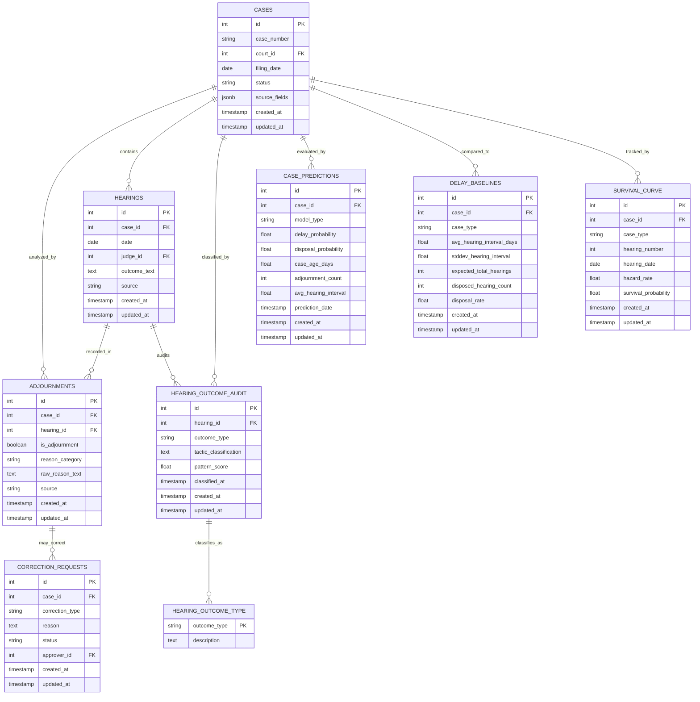

# Architecture: Delay Detection & Predictions Domain (Mermaid ER Diagram)

This diagram shows Phase 1 delay detection, ML predictions, and baseline analytics.

## Mermaid ER Diagram



## Entity Descriptions

### ADJOURNMENTS (Phase 1 Detection)
Core entity for delay tactic recording.
- **Key fields**: 
  - `case_id` (FK): Links to CASES
  - `hearing_id` (FK): Links to specific HEARINGS
  - `is_adjournment`: Boolean flag (adjournment vs. other outcome)
  - `reason_category`: Classified delay tactic (e.g., "adjournment_by_defendant", "adjournment_by_court")
  - `raw_reason_text`: Original extracted text from hearing outcome
  - `source`: Where data came from (e.g., "ecourts", "njdg")

- **Example categories**:
  - `adjournment_by_defendant` → Defendant requests delay
  - `adjournment_by_plaintiff` → Plaintiff requests delay
  - `adjournment_by_court` → Judge orders adjournment
  - `bench_change` → Judge change causes delay
  - `judge_unavailable` → Judicial vacancy
  - `witness_not_present` → Evidence gathering delay

- **Data quality**: reason_category comes from NLP classification of hearing outcome_text

### HEARING_OUTCOME_AUDIT
Audit trail of NLP classification for each hearing.
- **Key fields**:
  - `hearing_id` (FK): Links to HEARINGS
  - `outcome_type`: Classification (e.g., "ADJOURNMENT", "DISPOSED", "HEARING_SCHEDULED")
  - `tactic_classification`: Detailed tactic extracted via regex patterns
  - `pattern_score`: Confidence score (0.0-1.0) from pattern matching

- **Tactic examples**:
  - `"party_requested_postponement"` (score: 0.95)
  - `"evidence_not_ready"` (score: 0.87)
  - `"administrative_delay"` (score: 0.72)

- **Purpose**: Enables auditing of ML decisions and ground truth for model training

### HEARING_OUTCOME_TYPE (Controlled Vocabulary)
Enumeration of valid hearing outcomes.
- **Values**:
  - `ADJOURNMENT` → Case postponed
  - `DISPOSED` → Case closed (judgment issued)
  - `HEARING_SCHEDULED` → Next hearing set
  - `TRANSFER` → Case transferred to another court
  - `WITHDRAWN` → Party withdrew case

### CASE_PREDICTIONS (ML Output)
Delay risk predictions for each case.
- **Key fields**:
  - `model_type`: Which ML pipeline (e.g., "phase1_gradient_boost", "phase2_ensemble")
  - `delay_probability`: ML prediction (0.0-1.0) case will experience further delay
  - `disposal_probability`: ML prediction (0.0-1.0) case will be resolved within X months
  - `case_age_days`: How long case has been pending
  - `adjournment_count`: Current adjournment tally
  - `avg_hearing_interval`: Average days between hearings
  - `prediction_date`: When prediction was made

- **Example**: 
  ```
  Case #2024-001: 
  - delay_probability: 0.89 (89% likely further delays)
  - disposal_probability: 0.12 (12% likely to dispose in 6 months)
  - adjournment_count: 7 (7 recorded adjournments)
  - avg_hearing_interval: 145 days
  ```

- **Usage**: Feeds dashboard alerts, powers "Risk Score" column in UI

### DELAY_BASELINES (Statistical Reference)
Baseline statistics per case type for anomaly detection.
- **Key fields**:
  - `case_type`: Stratification (e.g., "criminal_theft", "civil_contract")
  - `avg_hearing_interval_days`: Baseline expected days between hearings
  - `stddev_hearing_interval`: Standard deviation for anomaly detection
  - `expected_total_hearings`: Typical number of hearings to disposition
  - `disposal_rate`: Percentage of cases reaching judgment vs. withdrawal
  - `disposed_hearing_count`: How many hearings typically occur before disposal

- **Example**:
  ```
  Case Type: criminal_theft
  - avg_hearing_interval: 120 days
  - stddev: 45 days
  - expected_total_hearings: 8
  - disposal_rate: 0.92 (92% get judged)
  
  Any case with hearing gap > 210 days (120 + 2*stddev) = flagged as anomaly
  ```

- **Purpose**: Enables case-type-aware delay detection

### SURVIVAL_CURVE (Survival Analysis)
Statistical survival analysis results (Kaplan-Meier estimator).
- **Key fields**:
  - `case_id` (FK): Links to specific case
  - `case_type`: Stratified analysis
  - `hearing_number`: Sequential hearing index (1st, 2nd, 3rd...)
  - `hearing_date`: When hearing occurred
  - `hazard_rate`: Instantaneous risk of disposal at this hearing
  - `survival_probability`: Probability case still pending at this hearing

- **Example**:
  ```
  Case #2024-001, criminal_theft:
  - Hearing 1 (day 0): survival_prob = 1.0 (100% still pending)
  - Hearing 3 (day 365): survival_prob = 0.87 (13% disposed by now)
  - Hearing 8 (day 1095): survival_prob = 0.34 (66% disposed by now)
  ```

- **Purpose**: Enables long-term case trajectory forecasting

### CORRECTION_REQUESTS
Quality correction workflow (links back to adjournments for data fixing).
- **Key fields**:
  - `case_id` (FK): Case being corrected
  - `correction_type`: What's wrong (e.g., "adjournment_date_wrong", "judge_misidentified")
  - `status`: `pending` → `approved` → `rejected`
  - `approver_id` (FK): Moderator who approved
  - `reason`: Explanation from user

- **Moderation flow**:
  1. User submits CORRECTION_REQUEST
  2. Moderator reviews
  3. If approved → UPDATE affected ADJOURNMENT record
  4. If rejected → Log reason for ML training

## Data Flow: From Hearing to Prediction

```
HEARING (outcome_text in raw OCR)
  ↓ (NLP Tactic Classification)
HEARING_OUTCOME_AUDIT (tactic_classification + pattern_score)
  ↓ (Aggregate over case)
ADJOURNMENTS (is_adjournment=true, reason_category)
  ↓ (Count + Statistics)
DELAY_BASELINES (avg_hearing_interval, disposal_rate)
  ↓ (Feature Engineering)
CASE_PREDICTIONS (delay_probability, disposal_probability)
  ↓ (Display)
UI Dashboard (Risk score, alerts)
```

## Query Examples

### Find high-risk cases
```sql
SELECT 
  c.case_number,
  cp.delay_probability,
  cp.adjournment_count,
  c.filing_date,
  (NOW()::date - c.filing_date) as days_pending
FROM cases c
JOIN case_predictions cp ON c.id = cp.case_id
WHERE cp.delay_probability > 0.8
  AND cp.prediction_date > NOW() - INTERVAL '7 days'
ORDER BY cp.delay_probability DESC;
```

### Compare case to baseline
```sql
SELECT 
  c.case_number,
  COUNT(h.id) as current_hearing_count,
  db.expected_total_hearings,
  AVG(DATE_PART('day', h.date - LAG(h.date) OVER (ORDER BY h.date)))::int as avg_interval,
  db.avg_hearing_interval_days as baseline_interval
FROM cases c
JOIN hearings h ON c.id = h.case_id
JOIN delay_baselines db ON c.id = db.case_id
WHERE c.case_type = 'criminal_theft'
GROUP BY c.id, db.expected_total_hearings, db.avg_hearing_interval_days
HAVING AVG(...) > db.avg_hearing_interval_days * 1.5;
```

### Audit tactic classifications
```sql
SELECT 
  hoa.tactic_classification,
  COUNT(*) as frequency,
  AVG(hoa.pattern_score) as avg_confidence
FROM hearing_outcome_audit hoa
WHERE hoa.created_at > NOW() - INTERVAL '30 days'
GROUP BY hoa.tactic_classification
ORDER BY avg_confidence DESC;
```

### Get case survival probability
```sql
SELECT 
  c.case_number,
  sc.hearing_number,
  sc.hearing_date,
  sc.survival_probability,
  sc.hazard_rate
FROM cases c
JOIN survival_curve sc ON c.id = sc.case_id
WHERE c.case_uid = $1
ORDER BY sc.hearing_number;
```
