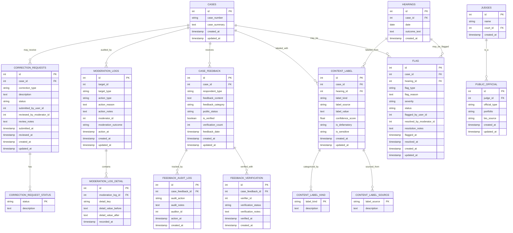

# Architecture: Moderation & Quality Control Domain (Mermaid ER Diagram)

This diagram shows the moderation pipeline, content labeling, feedback management, and audit trails.

## Mermaid ER Diagram



## Entity Descriptions

### CORRECTION_REQUESTS
User submissions for data corrections (main moderation entry point).
- **Key fields**:
  - `case_id` (FK): Which case needs correction
  - `correction_type`: What's wrong (e.g., "judge_name", "hearing_date", "parties")
  - `description`: User's explanation of what's incorrect
  - `status`: `pending` → `approved` → `rejected` → `applied`
  - `submitted_by_user_id`: Non-identified user ID
  - `reviewed_by_moderator_id`: Staff moderator who processed
  - `review_notes`: Moderator's assessment
  - `submitted_at` / `reviewed_at`: Timestamps for SLA tracking

- **Example**:
  ```
  Submitted: "Judge name should be 'Sharma' not 'Verma'"
  Correction Type: "judge_name"
  Status: pending → approved → applied
  Moderator: James@judiciary.org
  Decision: "Verified via court website"
  ```

- **Moderation flow**:
  1. User submits CORRECTION_REQUEST
  2. Moderator reviews evidence (links to original source)
  3. If approved → AUTO-UPDATE case/hearing data
  4. If rejected → Log reason for training

### CORRECTION_REQUEST_STATUS (Controlled Vocabulary)
Enumeration of valid statuses for corrections.
- **Values**:
  - `pending` → Awaiting moderator review
  - `approved` → Moderator validated, ready to apply
  - `rejected` → Moderator disagreed with correction
  - `applied` → Correction written to database
  - `disputed` → New dispute filed against previous decision

### MODERATION_LOGS
Comprehensive audit trail of all moderator actions.
- **Key fields**:
  - `target_id` + `target_type`: Which object was moderated (case/hearing/judge/user)
  - `action_type`: What moderator did (flag/remove/review/edit/verify)
  - `action_reason`: Why action was taken (violates policy X, data error, etc.)
  - `action_notes`: Detailed reasoning
  - `moderator_id`: Which staff member
  - `moderation_outcome`: Result (accepted/rejected/escalated)
  - `action_at`: When action occurred

- **Example**:
  ```
  Target: Case #2024-001
  Action: "flag_for_review"
  Reason: "Hearing outcome contains potentially defamatory language"
  Moderator: jane@judiciary.org
  Outcome: "Escalated to legal review"
  ```

- **Purpose**: Full auditability of moderation decisions

### MODERATION_LOG_DETAIL
Detailed before/after tracking for edits.
- **Key fields**:
  - `moderation_log_id` (FK): Links to parent MODERATION_LOG
  - `detail_key`: Field name (e.g., "judge_name", "hearing_date")
  - `detail_value_before`: Original value
  - `detail_value_after`: New value

- **Example**:
  ```
  Key: "judge_name"
  Before: "Verma"
  After: "Sharma"
  ```

### CASE_FEEDBACK
Citizen contributions, corrections, and feedback.
- **Key fields**:
  - `case_id` (FK): Which case
  - `respondent_type`: Who submitted (e.g., "litigant", "advocate", "concerned_citizen", "journalist")
  - `feedback_content`: Full text of feedback
  - `feedback_category`: Topic (e.g., "data_correction", "procedural_concern", "compliment")
  - `public_status`: Visibility (`public`, `internal_only`, `draft`, `rejected`)
  - `is_verified`: Has it been verified by researchers?
  - `verification_count`: How many independent verifications?
  - `feedback_date`: When feedback was submitted

- **Example**:
  ```
  Respondent: "litigant" (case participant)
  Category: "data_correction"
  Feedback: "The judge assigned to hearing on Jan 15 was not Sharma, it was Patel"
  Public Status: "internal_only" (waiting verification)
  Verified: false (no verification yet)
  ```

- **Purpose**: Crowdsourced data quality improvement

### FEEDBACK_AUDIT_LOG
Detailed tracking of feedback lifecycle.
- **Key fields**:
  - `case_feedback_id` (FK): Links to feedback
  - `audit_action`: Event (submitted/flagged/verified/published/rejected)
  - `audit_notes`: Details of action
  - `auditor_id`: Who took action (moderator)
  - `action_at`: When

- **Workflow**:
  1. submitted → Initial feedback recorded
  2. flagged → Moderator marked for review
  3. verified → Researcher confirmed accuracy
  4. published → Made public
  5. rejected → Deemed unreliable

### FEEDBACK_VERIFICATION
Multi-reviewer verification system.
- **Key fields**:
  - `case_feedback_id` (FK): Which feedback being verified
  - `verifier_id`: Researcher ID
  - `verification_status`: `pending`, `verified`, `invalid`, `unable_to_verify`
  - `verification_notes`: Researcher's assessment
  - `verified_at`: When verification occurred

- **Purpose**: Feedback needs 2+ independent verifications before publication
- **Example**:
  ```
  Feedback: "Judge was not Sharma"
  Verifier 1: "verified" (checked court website)
  Verifier 2: "verified" (confirmed via official records)
  → Feedback becomes verified, case record updated
  ```

### CONTENT_LABEL
Sensitive content classification (PII, defamation, bias).
- **Key fields**:
  - `case_id` / `hearing_id` (FK): What's being labeled
  - `label_kind`: Taxonomy (see CONTENT_LABEL_KIND below)
  - `label_source`: How it was detected (manual/automated)
  - `label_value`: Specific label (e.g., "contains_phone_number", "contains_bank_account")
  - `confidence_score`: ML confidence (0.0-1.0)
  - `is_defamatory`: Boolean flag for defamation risk
  - `is_sensitive`: Boolean flag for general sensitivity (PII, etc.)

- **Label kinds** (examples):
  - `pii_phone_number` → Phone number detected
  - `pii_email_address` → Email address
  - `pii_bank_account` → Financial account number
  - `defamatory_allegation` → Potentially libelous statement
  - `gender_bias` → Gender-based language detected
  - `casteist_language` → Caste-related slurs detected

### CONTENT_LABEL_KIND (Controlled Vocabulary)
Enumeration of content classification types.
- **Values**: `pii_phone`, `pii_email`, `pii_bank`, `defamatory`, `gender_bias`, `casteist_language`, etc.

### CONTENT_LABEL_SOURCE (Controlled Vocabulary)
How content was labeled.
- **Values**:
  - `manual_review` → Human moderator identified
  - `automated_pii_scanner` → Regex-based detection
  - `automated_ml_classifier` → ML model flagged
  - `nlp_bias_detector` → NLP bias classifier

### FLAG
User/moderator flags for content requiring special handling.
- **Key fields**:
  - `case_id` / `hearing_id` (FK): What's being flagged
  - `flag_type`: Category (e.g., "defamation", "privacy_breach", "data_quality", "abusive_language")
  - `flag_reason`: Why flagged
  - `severity`: Priority (`low`, `medium`, `high`, `critical`)
  - `status`: `open`, `in_review`, `escalated`, `resolved`, `closed`
  - `flagged_by_user_id`: Who raised flag (citizen or moderator)
  - `resolved_by_moderator_id`: Who handled it
  - `resolution_notes`: How it was resolved
  - `flagged_at` / `resolved_at`: Timestamps

- **Example**:
  ```
  Type: "defamation"
  Severity: "high"
  Reason: "Hearing outcome contains unverified allegations"
  Status: "escalated" → Sent to legal team
  ```

### PUBLIC_OFFICIAL
Profile information for judges (supports public biographical data).
- **Key fields**:
  - `judge_id` (FK): Links to JUDGES
  - `official_type`: Role (e.g., "judge", "justice", "retired_judge")
  - `portfolio`: Current assignment (e.g., "civil_division", "criminal_division")
  - `bio_source`: Where biographical data came from

- **Purpose**: Enables public profiles with verified information

## Moderation Workflows

### Workflow 1: User Submits Correction
```
1. User submits CORRECTION_REQUEST
2. Moderator reviews via MODERATION_LOGS interface
3. Decision: approved/rejected (stored in CORRECTION_REQUEST.status)
4. If approved → Auto-update case data + log to MODERATION_LOG_DETAIL
5. User notified of decision
```

### Workflow 2: Flag for Sensitive Content
```
1. Content LABEL or FLAG created
2. Moderator review task created
3. Moderator decides: publish/remove/redact
4. Action recorded in MODERATION_LOGS
5. Before/after values in MODERATION_LOG_DETAIL
```

### Workflow 3: Crowdsourced Verification
```
1. CASE_FEEDBACK submitted by citizen
2. Public status = "internal_only" (not published yet)
3. Researchers verify via FEEDBACK_VERIFICATION (2+ reviewers needed)
4. Once verified, public_status = "public"
5. Audit trail in FEEDBACK_AUDIT_LOG
```

## Query Examples

### Find recent correction requests awaiting review
```sql
SELECT 
  cr.id,
  c.case_number,
  cr.correction_type,
  cr.description,
  (NOW() - cr.submitted_at)::text as waiting_duration
FROM correction_requests cr
JOIN cases c ON cr.case_id = c.id
WHERE cr.status = 'pending'
ORDER BY cr.submitted_at;
```

### Get moderation activity summary
```sql
SELECT 
  DATE(ml.action_at) as action_date,
  ml.action_type,
  ml.moderation_outcome,
  COUNT(*) as count
FROM moderation_logs ml
WHERE ml.action_at > NOW() - INTERVAL '30 days'
GROUP BY DATE(ml.action_at), ml.action_type, ml.moderation_outcome
ORDER BY action_date DESC;
```

### Find sensitive content flagged
```sql
SELECT 
  c.case_number,
  cl.label_kind,
  cl.confidence_score,
  cl.is_defamatory,
  cl.created_at
FROM content_label cl
JOIN cases c ON cl.case_id = c.id
WHERE cl.is_defamatory = true OR cl.is_sensitive = true
ORDER BY cl.created_at DESC;
```

### Crowdsourcing verification status
```sql
SELECT 
  cf.id,
  c.case_number,
  cf.feedback_category,
  COUNT(fv.id) as verification_count,
  SUM(CASE WHEN fv.verification_status = 'verified' THEN 1 ELSE 0 END) as verified_count
FROM case_feedback cf
JOIN cases c ON cf.case_id = c.id
LEFT JOIN feedback_verification fv ON cf.id = fv.case_feedback_id
WHERE cf.public_status = 'internal_only'
GROUP BY cf.id, c.case_number, cf.feedback_category
ORDER BY verification_count DESC;
```
